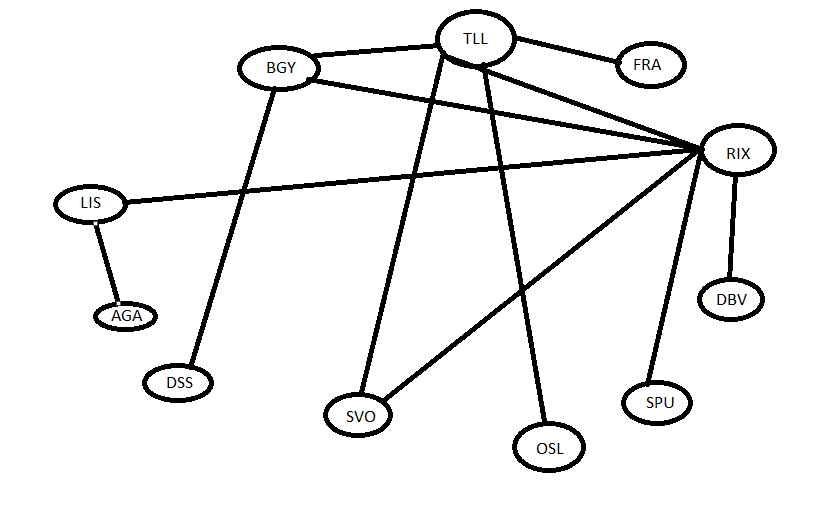

# Breadth-first search modified 
This algorithm creates line between two airports on the map. 

- Iterates through graph with starting point until finds end point.
- Cleares path until finds ending point.
- If all nodes are visited, it stops and did not found end point.

